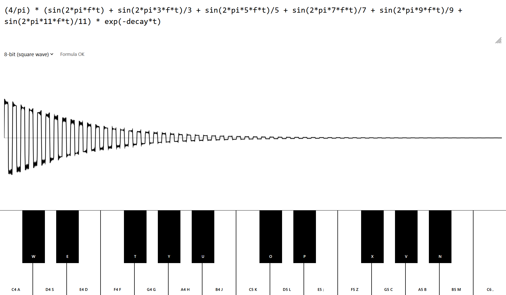

# Trigosynth

A [browser-based synthesizer](https://kunkelalexander.github.io/trigosynth/) where you define the sound of each note as a mathematical formula using sines, cosines, and exponentials. Play notes with your keyboard or by clicking the piano keys. Vibe-coded using LLMs.

 

This tool is based on [Íñigo Quílez](https://iquilezles.org/)'s video [Live coding musical instruments with mathematics](https://www.youtube.com/watch?v=ogFAHvYatWs). I rebuilt the tool so that I could play with it on my fone. All credit goes to Íñigo Quílez who is amazing. Please visit their blog. :) 


## Devlog

### 17.05.2026
- Improve mobile layout after testing
- Fix a bug where the keyboard would capture input keys and not allow you to type equations
- Fix bug where holding a key would lead to it not being released because the browser triggers a long-press action
- Fix bug where pressing multiple keys would lead to them not being released correctly
- Add seesaw

### 16.05.2026
- When you press a key, the app generates a PCM audio buffer entirely in JavaScript using the Web Audio API

- Your formula string is compiled into a native JS function via `new Function(...)`. A set of math aliases (`sin`, `cos`, `exp`, `pi`, …) is injected as local constants so you can write bare names. The result is a plain function `(t, f, freq, decay) => number`.

- At first, I wanted to go with `math.js` for parsing the input equation but the evaluation was too slow and I don't like the idea of having external dependencies for such a simple app

-  In the end, I decided to compile a string into a regular JavaScript function at runtime for maximum flexibility. The code requried is very simple but I was worried about the security aspect: Users can execute arbitrary JavaScript code in the input box. But since the app runs as a static HTML/JS page, the function is executed in the user's own browser tab with the permissions that they already have. So, no specific vulnerability here! :) 

- For each piano key, the app then looks up the note's frequency `f` in Hz (e.g. A4 = 440 Hz) using the standard MIDI formula `f = 440 × 2^((midi − 69) / 12)`. It then fills a 10-second mono PCM buffer sample-by-sample:

```
for each sample i:
    t = i / sampleRate          // time in seconds
    value = formula(t, f, ...)
    sample[i] = tanh(value) × 0.8
```

`tanh` acts as a soft clipper, keeping the output in the range (−0.8, 0.8) regardless of formula amplitude.

- For sound to be produced, the formula must oscillate at an audio frequency (roughly 20–20 000 Hz). A formula like `t` only produces a slowly rising ramp — the speaker cone moves to a fixed position and stays there, producing only a brief click. A formula like `sin(2*pi*f*t)` produces a pure sine wave at the note's frequency, which is what the ear perceives as a pitch. Mixing multiple harmonics (`sin(2*pi*f*t) + 0.5*sin(2*pi*2*f*t) + …`) changes the timbre. 
- I really recommend [The Math Behind Music and Sound Synthesis](https://www.youtube.com/watch?v=Y7TesKMSE74) by Gonkee for an in-depth explanation. 

- The synthesized buffer is played through a `GainNode` with a short fade-in (1 ms) to avoid clicks. On key release, the gain is exponentially ramped to silence over 2.5 seconds, giving a natural decay tail.

- The waveform display renders the formula evaluated at a low test frequency (20 Hz) over 3 seconds. This lets you see the general shape of the amplitude envelope, but note that it does not convey oscillation speed — a formula needs fast oscillation to be audible even if its envelope looks non-zero in the preview.
